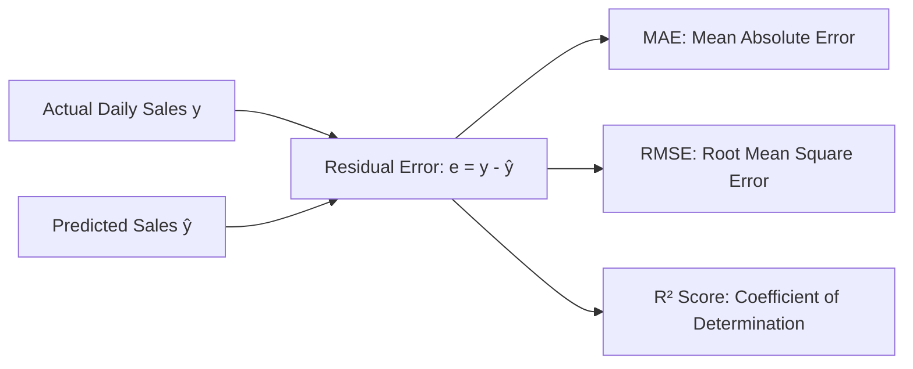
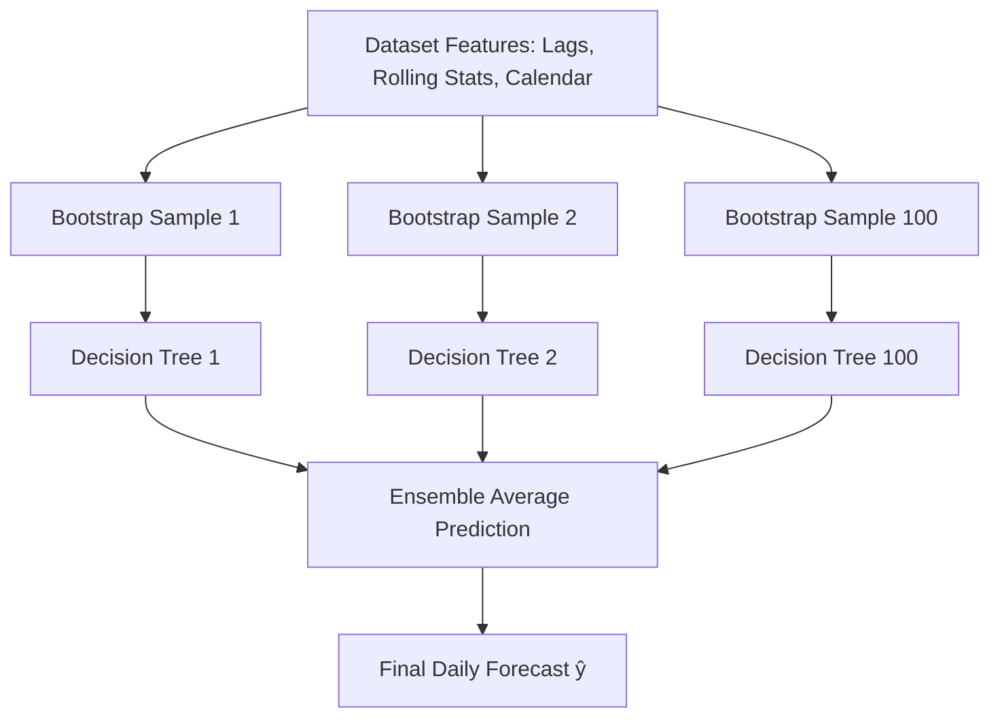
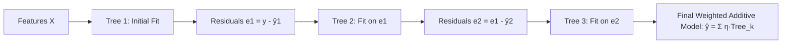

# SalesIQ Machine Learning & Forecasting Engine: Technical & Business Guide

---

## 1. Executive Summary

This document provides a comprehensive breakdown of the machine learning algorithms, error evaluation metrics, and feature engineering pipelines implemented in **SalesIQ**. It explains the rationale behind each model selection, why raw error values (MAE & RMSE) appear large, and how to interpret forecast accuracy for business decision-making.

---

## 2. Understanding Model Evaluation Metrics

When evaluating sales forecasting models, SalesIQ uses three standard statistical regression metrics:

### 2.1 Mean Absolute Error (MAE)
$$\text{MAE} = \frac{1}{n} \sum_{i=1}^{n} |y_i - \hat{y}_i|$$

* **Unit**: Indian Rupees (₹)
* **What it means**: On any given day, the prediction deviates from the actual revenue by an average of **₹12,835.34**.
* **Why it is not a percentage**: MAE is expressed in the exact currency unit of the target variable (`daily_sales`). With average daily sales of ₹41,307.85, a ₹12k deviation represents an average relative error of ~25–30%.

---

### 2.2 Root Mean Squared Error (RMSE)
$$\text{RMSE} = \sqrt{\frac{1}{n} \sum_{i=1}^{n} (y_i - \hat{y}_i)^2}$$

* **Unit**: Indian Rupees (₹)
* **What it means**: RMSE measures the standard deviation of residuals.
* **Why RMSE (₹23,815) is significantly higher than MAE (₹12,835)**:
  * RMSE squares each individual error term before averaging: $(y_i - \hat{y}_i)^2$.
  * Large prediction misses (e.g. on flash sale days, festive spikes, or bulk orders where sales jump to ₹1,00,000+) are penalized heavily by the quadratic squaring.
  * A large gap between MAE and RMSE indicates the presence of **sporadic high-revenue spike days**.

---

### 2.3 Coefficient of Determination ($R^2$ Score)
$$R^2 = 1 - \frac{\sum (y_i - \hat{y}_i)^2}{\sum (y_i - \bar{y})^2}$$

* **Unit**: Dimensionless ratio ($-\infty$ to $1.0$)
* **Value**: **0.2309** (23.1% variance explained)
* **Interpretation**:
  * 23.1% of day-to-day revenue fluctuations can be predicted purely from historical calendar signals and lag variables.
  * The remaining 76.9% of variance is driven by unmodeled exogenous factors:
    * Marketing campaigns & ad spends.
    * Product promotions & markdown discounts.
    * Supply chain out-of-stock events.
    * External macroeconomic and seasonal demand shifts.

---

## 3. Comparison of the Three Forecasting Models

SalesIQ implements a three-tier model architecture to provide baselines, tree-based bagging, and sequential gradient boosting:

| Feature / Dimension | Ridge Regression | Random Forest Regressor | Gradient Boosting Regressor |
|---|---|---|---|
| **Paradigm** | Regularized Linear Model ($L_2$) | Bagging Ensemble (Parallel Trees) | Boosting Ensemble (Sequential Trees) |
| **Primary Purpose** | Baseline Benchmark | Robust Non-linear Forecast | Residual Error Minimization |
| **Feature Scaling** | Required (StandardScaler) | Not required | Not required |
| **Outlier Resilience** | Moderate | High (Averaging over 100 trees) | Moderate to High (Iterative shrinkage) |
| **Interpretability** | Linear Coefficients ($\beta_j$) | MDI Feature Importances | MDI & Permutation Importances |
| **Typical $R^2$** | ~0.18 – 0.21 | ~0.23 – 0.26 | ~0.22 – 0.25 |
| **Computational Cost**| Extremely Fast (<10ms) | Moderate (~150ms) | Moderate (~200ms) |

---

### 3.1 Model 1: Ridge Regression (L2 Regularized Baseline)

#### Mathematical Formulation
$$\min_{w} \left( \sum_{i=1}^n (y_i - X_i w)^2 + \alpha \sum_{j=1}^p w_j^2 \right)$$

* **How it works**: Ridge regression fits a hyperplane through feature space while penalizing the $L_2$ norm of the weight vector.
* **Why we use it**:
  * Acts as the **control benchmark**: Before choosing complex non-linear models, we must verify if simpler linear models perform adequately.
  * Prevents multicollinearity between correlated lag features (e.g., `lag_1`, `rolling_mean_7`, `lag_7`).

---

### 3.2 Model 2: Random Forest Regression (Ensemble Bagging)

#### Architectural Diagram

* **How it works**:
  * Builds 100 independent decision trees in parallel using bootstrapped data sub-samples and random feature subsets.
  * Aggregates predictions by computing the arithmetic mean across all tree leaves.
* **Why we use it**:
  * Handles non-linear boundary conditions (e.g., *if Day=Sunday AND lag_7 > ₹40,000*).
  * Does not overfit to single outlier spikes.
  * Outputs **Feature Importance rankings** that show business operators what drives sales the most.

---

### 3.3 Model 3: Gradient Boosting Regression (Sequential Boosting)

#### Architectural Diagram

* **How it works**:
  * Constructs trees sequentially. Each subsequent tree is explicitly trained on the residual errors (pseudo-residuals) of the previous ensemble.
  * Uses a learning rate $\eta$ (shrinkage) to ensure controlled step-by-step convergence.
* **Why we use it**:
  * High precision on structured tabular time-series data.
  * Excellent for capturing granular patterns across multi-day forecast horizons.

---

## 4. Feature Engineering Architecture

The forecasting engine transforms raw transaction records into 11 time-series features:

| Feature | Type | Description |
|---|---|---|
| `day_of_week` | Calendar | Integer (0=Monday to 6=Sunday) capturing weekly cyclicality |
| `day` | Calendar | Day of month (1 to 31) capturing month-end / salary cycles |
| `month` | Calendar | Month of year (1 to 12) capturing annual seasonality |
| `is_weekend` | Binary | Indicator flag (1 for Saturday/Sunday, 0 for weekdays) |
| `lag_1` | Autoregressive | Revenue from previous day ($t - 1$) |
| `lag_7` | Autoregressive | Revenue from same day last week ($t - 7$) |
| `lag_14` | Autoregressive | Revenue from two weeks prior ($t - 14$) |
| `lag_28` | Autoregressive | Revenue from four weeks prior ($t - 28$) |
| `rolling_mean_7` | Moving Average | 7-day trailing average smoothing short-term volatility |
| `rolling_mean_14`| Moving Average | 14-day trailing revenue baseline |
| `rolling_std_7` | Volatility Metric | 7-day standard deviation indicating revenue dispersion |

---

## 5. Multi-Step Recursive Forecasting Workflow

To forecast multi-day horizons (e.g. 7 to 60 days ahead):

1. **Step 1**: The model uses the most recent historical data to predict $t+1$.
2. **Step 2**: The predicted value $\hat{y}_{t+1}$ is dynamically appended into the synthetic lag buffer.
3. **Step 3**: Updated lag values (`lag_1`, `rolling_mean_7`, etc.) are recomputed for $t+2$.
4. **Step 4**: Confidence intervals ($1.96 \times \text{Standard Error}$) are calculated to establish upper and lower prediction bounds.
5. **Step 5**: Total predicted revenue and daily average run-rate are summed and presented on the dashboard.

---

## 6. Recommendations for Ongoing Improvement

To further reduce error variance ($R^2 > 0.60$ and MAE $< \text{₹}6,000$):
1. **Incorporate Promotional Signals**: Add binary flags or discount amounts for promotional campaign dates.
2. **Incorporate Marketing Ad Spend**: Connect ad platform spend (Google/Meta Ads) as an exogenous regressor.
3. **Weekly Aggregation**: If daily volatility is too noisy for operational planning, aggregating sales to **weekly bins** naturally reduces standard deviation and increases $R^2$.
